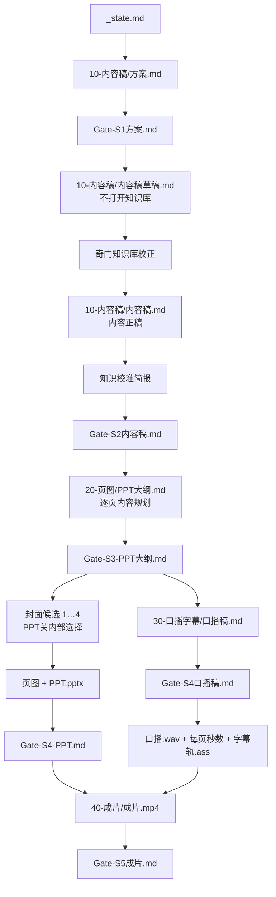

# 文件流

节点全是文件。总控只读写 `_state.md`。六个主把关项依次是方案、内容稿、PPT大纲、PPT、口播稿、成片。教研看前三项，制作看 PPT 和口播稿，签发看成片。封面选择是 PPT 关内部前置动作，不单独占一道主关。硬检查和校准简报不送审。

`方案.md` 的「预计成品」锁定规模：内容稿字数、视频时长、停顿秒数、PPT页数。方案不拆每一页讲什么。方案通过后先写 `内容稿草稿.md`，这一步不打开知识库，草稿可以和知识库不一样。再用奇门知识库校正明确冲突，写成 `内容稿.md`。知识库没覆盖的内容留在正稿里，任何选题都成稿。正稿是像完整文章、扣题、兑现标题、去掉元数据后可直接发布的书面母稿，也是所有下游内容的唯一事实来源；方案里的练习必须写进文章。`PPT大纲.md` 只保留每页页码、标题、正文和提示词，页数必须等于方案 PPT页数；页图/PPT读取大纲，张数必须等于大纲。口播稿以内容正稿为内容依据、以 PPT 大纲为分页依据，时长和停顿必须等于方案；配音与字幕只读取已审核口播稿。简报备查，不另开人审关。草稿不送审。
